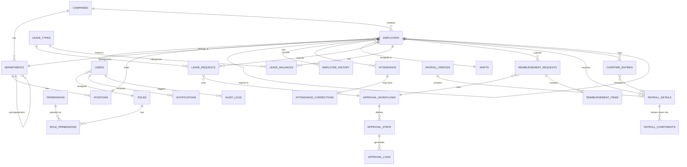

# Entity Relationship Diagram (ERD) — Sistem HRIS & Payroll
## Dokumen Pendamping PRD & Payroll Engine Spec

**Versi:** 1.0
**Tanggal:** 23 September 2026
**Database:** PostgreSQL (rekomendasi)

---

## 1. Daftar Modul & Grup Tabel

| Grup | Tabel |
|---|---|
| **Auth & RBAC** | `users`, `roles`, `permissions`, `role_permissions` |
| **Organisasi** | `companies`, `departments`, `positions` |
| **Employee** | `employees`, `employee_history` |
| **Absensi** | `shifts`, `attendance`, `attendance_corrections`, `holidays` |
| **Cuti & Izin** | `leave_types`, `leave_balances`, `leave_requests` |
| **Approval Workflow (generik)** | `approval_workflows`, `approval_steps`, `approval_logs` |
| **Payroll** | `payroll_periods`, `payroll_details`, `payroll_components`, `overtime_entries` |
| **Rate/Config Pajak & BPJS** | `ter_rates`, `ptkp_rates`, `bpjs_rates`, `overtime_rules` |
| **Reimbursement (Fase 2)** | `reimbursement_requests`, `reimbursement_items` |
| **Notifikasi** | `notifications` |
| **Audit** | `audit_logs` |

---

## 2. Diagram Relasi (Mermaid ERD)

---

## 3. Definisi Tabel Lengkap

### 3.1 Auth & RBAC

**`users`**
| Kolom | Tipe | Keterangan |
|---|---|---|
| id | UUID (PK) | |
| email | VARCHAR(255) UNIQUE NOT NULL | |
| password_hash | VARCHAR(255) NOT NULL | |
| role_id | UUID (FK → roles.id) | |
| is_active | BOOLEAN DEFAULT true | |
| last_login_at | TIMESTAMP | |
| created_at | TIMESTAMP | |
| updated_at | TIMESTAMP | |

**`roles`**
| Kolom | Tipe | Keterangan |
|---|---|---|
| id | UUID (PK) | |
| name | VARCHAR(50) UNIQUE | staff, manager, hr_admin, finance, super_admin |
| description | TEXT | |

**`permissions`**
| Kolom | Tipe | Keterangan |
|---|---|---|
| id | UUID (PK) | |
| code | VARCHAR(100) UNIQUE | misal `payroll.approve`, `employee.edit` |
| description | TEXT | |

**`role_permissions`** (many-to-many)
| Kolom | Tipe | Keterangan |
|---|---|---|
| role_id | UUID (FK → roles.id) | |
| permission_id | UUID (FK → permissions.id) | |
| PRIMARY KEY | (role_id, permission_id) | |

---

### 3.2 Organisasi

**`companies`**
| Kolom | Tipe | Keterangan |
|---|---|---|
| id | UUID (PK) | |
| name | VARCHAR(255) | |
| npwp | VARCHAR(30) | untuk keperluan pelaporan pajak |
| risk_class_jkk | VARCHAR(20) | kelas risiko usaha (I–V) → menentukan rate JKK |
| address | TEXT | |
| created_at | TIMESTAMP | |

**`departments`**
| Kolom | Tipe | Keterangan |
|---|---|---|
| id | UUID (PK) | |
| company_id | UUID (FK → companies.id) | |
| name | VARCHAR(100) | |
| parent_department_id | UUID (FK → departments.id, nullable) | self-referencing untuk sub-departemen |

**`positions`**
| Kolom | Tipe | Keterangan |
|---|---|---|
| id | UUID (PK) | |
| department_id | UUID (FK → departments.id) | |
| title | VARCHAR(100) | |
| level | INT | untuk hierarki approval (junior=1, manager=3, dst) |

---

### 3.3 Employee

**`employees`**
| Kolom | Tipe | Keterangan |
|---|---|---|
| id | UUID (PK) | |
| user_id | UUID (FK → users.id, UNIQUE) | |
| company_id | UUID (FK → companies.id) | |
| department_id | UUID (FK → departments.id) | |
| position_id | UUID (FK → positions.id) | |
| supervisor_id | UUID (FK → employees.id, nullable) | self-referencing, atasan langsung |
| nik | VARCHAR(20) UNIQUE | Nomor Induk Kependudukan |
| employee_code | VARCHAR(20) UNIQUE | nomor pegawai internal |
| full_name | VARCHAR(255) | |
| birth_date | DATE | |
| join_date | DATE NOT NULL | |
| resign_date | DATE (nullable) | |
| employment_status | ENUM | `active`, `resigned`, `terminated`, `on_leave` |
| contract_type | ENUM | `permanent`, `contract`, `intern`, `probation` |
| marital_status_ptkp | VARCHAR(10) | `TK/0`, `K/1`, dst — menentukan kategori TER |
| base_salary | DECIMAL(15,2) | gaji pokok |
| fixed_allowance | DECIMAL(15,2) | tunjangan tetap (transport, jabatan, dll) |
| bank_account_number | VARCHAR(50) | |
| bank_name | VARCHAR(100) | |
| npwp | VARCHAR(30) (nullable) | |
| bpjs_kesehatan_number | VARCHAR(30) (nullable) | |
| bpjs_tk_number | VARCHAR(30) (nullable) | |
| created_at | TIMESTAMP | |
| updated_at | TIMESTAMP | |

**`employee_history`** (riwayat perubahan jabatan/gaji — penting untuk audit)
| Kolom | Tipe | Keterangan |
|---|---|---|
| id | UUID (PK) | |
| employee_id | UUID (FK → employees.id) | |
| field_changed | VARCHAR(50) | misal `base_salary`, `position_id`, `department_id` |
| old_value | TEXT | |
| new_value | TEXT | |
| effective_date | DATE | |
| changed_by | UUID (FK → users.id) | |
| created_at | TIMESTAMP | |

---

### 3.4 Absensi

**`shifts`**
| Kolom | Tipe | Keterangan |
|---|---|---|
| id | UUID (PK) | |
| company_id | UUID (FK → companies.id) | |
| name | VARCHAR(50) | misal "Shift Pagi", "Shift Malam" |
| start_time | TIME | |
| end_time | TIME | |
| is_overnight | BOOLEAN | true jika shift melewati tengah malam |
| late_tolerance_minutes | INT DEFAULT 0 | |

**`attendance`**
| Kolom | Tipe | Keterangan |
|---|---|---|
| id | UUID (PK) | |
| employee_id | UUID (FK → employees.id) | |
| shift_id | UUID (FK → shifts.id) | |
| date | DATE | |
| clock_in_time | TIMESTAMP (nullable) | |
| clock_out_time | TIMESTAMP (nullable) | |
| clock_in_location | POINT (lat/lng, nullable) | |
| clock_in_photo_url | VARCHAR(500) (nullable) | |
| device_fingerprint | VARCHAR(255) (nullable) | untuk deteksi anomali |
| status | ENUM | `present`, `late`, `absent`, `on_leave`, `sick`, `permit` |
| notes | TEXT | |
| created_at | TIMESTAMP | |
| UNIQUE | (employee_id, date) | satu record per karyawan per hari |

**`attendance_corrections`** (pengajuan koreksi lupa absen)
| Kolom | Tipe | Keterangan |
|---|---|---|
| id | UUID (PK) | |
| attendance_id | UUID (FK → attendance.id, nullable) | null jika hari itu tidak ada record sama sekali |
| employee_id | UUID (FK → employees.id) | |
| requested_clock_in | TIMESTAMP (nullable) | |
| requested_clock_out | TIMESTAMP (nullable) | |
| reason | TEXT | |
| status | ENUM | `pending`, `approved`, `rejected` |
| reviewed_by | UUID (FK → users.id, nullable) | |
| created_at | TIMESTAMP | |

**`holidays`**
| Kolom | Tipe | Keterangan |
|---|---|---|
| id | UUID (PK) | |
| company_id | UUID (FK → companies.id, nullable) | null = berlaku nasional |
| date | DATE | |
| name | VARCHAR(100) | |
| type | ENUM | `national`, `company_leave` (cuti bersama) |

---

### 3.5 Cuti & Izin

**`leave_types`**
| Kolom | Tipe | Keterangan |
|---|---|---|
| id | UUID (PK) | |
| name | VARCHAR(50) | Cuti Tahunan, Cuti Sakit, Cuti Melahirkan, dll |
| default_quota_days | INT | jatah default per tahun |
| is_paid | BOOLEAN | apakah dibayar |
| requires_document | BOOLEAN | misal surat dokter untuk cuti sakit |

**`leave_balances`**
| Kolom | Tipe | Keterangan |
|---|---|---|
| id | UUID (PK) | |
| employee_id | UUID (FK → employees.id) | |
| leave_type_id | UUID (FK → leave_types.id) | |
| year | INT | |
| quota_days | DECIMAL(5,2) | bisa prorata (misal 8.5) |
| used_days | DECIMAL(5,2) DEFAULT 0 | |
| adjusted_by | UUID (FK → users.id, nullable) | jika ada override manual |
| adjustment_reason | TEXT (nullable) | |
| UNIQUE | (employee_id, leave_type_id, year) | |

**`leave_requests`**
| Kolom | Tipe | Keterangan |
|---|---|---|
| id | UUID (PK) | |
| employee_id | UUID (FK → employees.id) | |
| leave_type_id | UUID (FK → leave_types.id) | |
| start_date | DATE | |
| end_date | DATE | |
| total_days | DECIMAL(5,2) | |
| reason | TEXT | |
| attachment_url | VARCHAR(500) (nullable) | |
| status | ENUM | `pending`, `approved`, `rejected`, `cancelled` |
| current_approval_step | INT DEFAULT 1 | untuk multi-level approval |
| created_at | TIMESTAMP | |

---

### 3.6 Approval Workflow (Generik/Reusable)

Dirancang generik supaya dipakai untuk leave_requests, reimbursement_requests, dan payroll approval — tidak perlu bikin tabel approval terpisah tiap modul.

**`approval_workflows`**
| Kolom | Tipe | Keterangan |
|---|---|---|
| id | UUID (PK) | |
| company_id | UUID (FK → companies.id) | |
| request_type | ENUM | `leave`, `reimbursement`, `payroll`, `attendance_correction` |
| name | VARCHAR(100) | misal "Approval Cuti Standar" |
| is_active | BOOLEAN | |

**`approval_steps`**
| Kolom | Tipe | Keterangan |
|---|---|---|
| id | UUID (PK) | |
| workflow_id | UUID (FK → approval_workflows.id) | |
| step_order | INT | urutan approval (1, 2, 3, ...) |
| approver_type | ENUM | `direct_supervisor`, `department_head`, `role` (misal harus role HR) |
| approver_role_id | UUID (FK → roles.id, nullable) | dipakai jika approver_type = `role` |

**`approval_logs`** (polymorphic — bisa merujuk ke request jenis apapun)
| Kolom | Tipe | Keterangan |
|---|---|---|
| id | UUID (PK) | |
| request_type | ENUM | `leave`, `reimbursement`, `payroll`, `attendance_correction` |
| request_id | UUID | ID dari tabel terkait (leave_requests.id, dll — polymorphic reference) |
| step_id | UUID (FK → approval_steps.id) | |
| approver_id | UUID (FK → users.id) | |
| action | ENUM | `approved`, `rejected` |
| notes | TEXT | |
| created_at | TIMESTAMP | |

> **Catatan desain:** `request_id` di `approval_logs` bersifat polymorphic (tidak pakai FK constraint langsung karena bisa merujuk tabel berbeda-beda). Alternatifnya, kalau ingin FK constraint penuh, bisa dipecah jadi tabel log per modul — trade-off antara fleksibilitas vs referential integrity, silakan pilih sesuai kebutuhan.

---

### 3.7 Payroll

**`payroll_periods`**
| Kolom | Tipe | Keterangan |
|---|---|---|
| id | UUID (PK) | |
| company_id | UUID (FK → companies.id) | |
| month | INT | 1–12 |
| year | INT | |
| status | ENUM | `draft`, `pending_approval`, `approved`, `locked` |
| processed_by | UUID (FK → users.id, nullable) | |
| approved_by | UUID (FK → users.id, nullable) | |
| locked_at | TIMESTAMP (nullable) | setelah locked, tidak bisa diubah lagi |
| UNIQUE | (company_id, month, year) | |

**`payroll_details`** (satu baris per karyawan per periode)
| Kolom | Tipe | Keterangan |
|---|---|---|
| id | UUID (PK) | |
| payroll_period_id | UUID (FK → payroll_periods.id) | |
| employee_id | UUID (FK → employees.id) | |
| base_salary | DECIMAL(15,2) | snapshot gaji pokok saat itu (prorata jika perlu) |
| fixed_allowance | DECIMAL(15,2) | |
| overtime_amount | DECIMAL(15,2) | |
| gross_income | DECIMAL(15,2) | total penghasilan bruto |
| bpjs_kesehatan_employee | DECIMAL(15,2) | |
| bpjs_kesehatan_company | DECIMAL(15,2) | |
| bpjs_tk_employee | DECIMAL(15,2) | |
| bpjs_tk_company | DECIMAL(15,2) | |
| pph21_amount | DECIMAL(15,2) | |
| other_deductions | DECIMAL(15,2) | kasbon, potongan alpha, dll |
| net_salary | DECIMAL(15,2) | take-home pay |
| rate_snapshot | JSONB | snapshot rate TER/BPJS yang dipakai saat hitung (untuk audit) |
| slip_pdf_url | VARCHAR(500) (nullable) | |
| created_at | TIMESTAMP | |
| UNIQUE | (payroll_period_id, employee_id) | |

**`payroll_components`** (breakdown detail tiap komponen, untuk fleksibilitas tunjangan/potongan custom)
| Kolom | Tipe | Keterangan |
|---|---|---|
| id | UUID (PK) | |
| payroll_detail_id | UUID (FK → payroll_details.id) | |
| component_type | ENUM | `earning`, `deduction` |
| component_name | VARCHAR(100) | misal "Tunjangan Makan", "Kasbon" |
| amount | DECIMAL(15,2) | |

**`overtime_entries`**
| Kolom | Tipe | Keterangan |
|---|---|---|
| id | UUID (PK) | |
| employee_id | UUID (FK → employees.id) | |
| date | DATE | |
| hours | DECIMAL(4,2) | |
| is_holiday | BOOLEAN | menentukan formula multiplier |
| status | ENUM | `pending`, `approved`, `rejected` |
| payroll_detail_id | UUID (FK → payroll_details.id, nullable) | terisi setelah masuk perhitungan payroll |
| created_at | TIMESTAMP | |

---

### 3.8 Rate & Konfigurasi Pajak/BPJS

**`ter_rates`**
| Kolom | Tipe | Keterangan |
|---|---|---|
| id | UUID (PK) | |
| kategori | CHAR(1) | `A`, `B`, `C` |
| batas_bawah | BIGINT | penghasilan bruto bulanan |
| batas_atas | BIGINT (nullable) | null = tidak terbatas |
| tarif | DECIMAL(6,5) | misal 0.00250 untuk 0.25% |
| berlaku_sejak | DATE | untuk histori rate |

**`ptkp_rates`**
| Kolom | Tipe | Keterangan |
|---|---|---|
| id | UUID (PK) | |
| status | VARCHAR(10) | `TK/0`, `K/1`, dst |
| amount_per_year | DECIMAL(15,2) | |
| berlaku_sejak | DATE | |

**`bpjs_rates`**
| Kolom | Tipe | Keterangan |
|---|---|---|
| id | UUID (PK) | |
| program | ENUM | `kesehatan`, `jht`, `jkk`, `jkm`, `jp` |
| company_percentage | DECIMAL(5,4) | |
| employee_percentage | DECIMAL(5,4) | |
| wage_cap | BIGINT (nullable) | batas atas upah yang dihitung |
| risk_class | VARCHAR(20) (nullable) | khusus untuk JKK, sesuai kelas risiko usaha |
| berlaku_sejak | DATE | |

**`overtime_rules`**
| Kolom | Tipe | Keterangan |
|---|---|---|
| id | UUID (PK) | |
| company_id | UUID (FK → companies.id) | |
| is_holiday | BOOLEAN | |
| hour_from | INT | jam ke berapa |
| hour_to | INT (nullable) | |
| multiplier | DECIMAL(3,2) | misal 1.5, 2.0 |

---

### 3.9 Reimbursement (Fase 2)

**`reimbursement_requests`**
| Kolom | Tipe | Keterangan |
|---|---|---|
| id | UUID (PK) | |
| employee_id | UUID (FK → employees.id) | |
| total_amount | DECIMAL(15,2) | |
| status | ENUM | `pending`, `approved`, `rejected`, `reimbursed` |
| current_approval_step | INT | |
| created_at | TIMESTAMP | |

**`reimbursement_items`**
| Kolom | Tipe | Keterangan |
|---|---|---|
| id | UUID (PK) | |
| reimbursement_request_id | UUID (FK → reimbursement_requests.id) | |
| category | VARCHAR(50) | transport, makan, kesehatan, dll |
| description | TEXT | |
| amount | DECIMAL(15,2) | |
| receipt_url | VARCHAR(500) | |

---

### 3.10 Notifikasi & Audit

**`notifications`**
| Kolom | Tipe | Keterangan |
|---|---|---|
| id | UUID (PK) | |
| user_id | UUID (FK → users.id) | |
| type | VARCHAR(50) | `leave_approval_needed`, `payslip_ready`, dll |
| title | VARCHAR(255) | |
| message | TEXT | |
| is_read | BOOLEAN DEFAULT false | |
| link_url | VARCHAR(500) (nullable) | |
| created_at | TIMESTAMP | |

**`audit_logs`**
| Kolom | Tipe | Keterangan |
|---|---|---|
| id | UUID (PK) | |
| user_id | UUID (FK → users.id) | |
| table_name | VARCHAR(100) | |
| record_id | UUID | |
| action | ENUM | `create`, `update`, `delete` |
| old_value | JSONB (nullable) | |
| new_value | JSONB (nullable) | |
| ip_address | VARCHAR(50) | |
| created_at | TIMESTAMP | |

---

## 4. Catatan Desain Penting

1. **Snapshot data di payroll_details**: `base_salary`, `fixed_allowance`, dan `rate_snapshot` disimpan sebagai snapshot (bukan hanya FK ke `employees`), supaya histori payroll tidak berubah retroaktif kalau data karyawan atau rate pajak di-update di kemudian hari.

2. **Polymorphic reference di `approval_logs`**: trade-off desain — pertimbangkan pakai tabel approval log terpisah per modul (`leave_approval_logs`, `reimbursement_approval_logs`) kalau tim lebih nyaman dengan FK constraint penuh; approach generik di atas lebih DRY tapi butuh validasi di level aplikasi.

3. **Index yang penting untuk performa**:
   - `attendance(employee_id, date)` — untuk query rekap bulanan
   - `payroll_details(payroll_period_id, employee_id)` — sudah unique constraint, otomatis ter-index
   - `leave_balances(employee_id, year)` — untuk cek saldo cuti real-time
   - `ter_rates(kategori, batas_bawah, batas_atas)` — untuk lookup tarif saat hitung payroll

4. **Soft delete**: Untuk tabel `employees`, jangan hard-delete — gunakan `employment_status = 'terminated'` dan kolom `resign_date`, karena data karyawan resign tetap dibutuhkan untuk histori payroll & pelaporan pajak tahunan.

5. **Multi-tenant ready**: Semua tabel utama sudah dirancang dengan `company_id` (langsung atau tidak langsung via `department_id`/`employee_id`), jadi struktur ini siap dikembangkan jadi multi-company/multi-tenant kalau mau dijadikan produk SaaS di masa depan.
