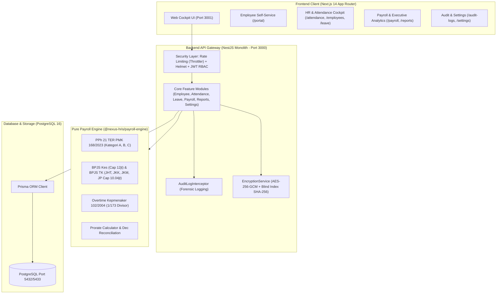

# Nexus HRIS — Enterprise-Grade Modular Monolith HRIS & Payroll Platform


**Nexus HRIS** adalah sistem *Human Resource Information System* dan *Payroll Calculation Engine* tingkat enterprise yang dirancang khusus untuk memenuhi standar regulasi ketenagakerjaan, perpajakan, dan jaminan sosial Republik Indonesia secara mutlak (*100% native statutory compliance*).

Sistem ini dibangun dengan arsitektur **Modular Monolith** berkinerja tinggi, mengisolasi logika perhitungan gaji murni dalam package zero-dependency, menerapkan enkripsi data pribadi **AES-256-GCM**, dan menyediakan antarmuka modern anti-slop bagi level eksekutif maupun staf mandiri.

---

## 🏛️ Arsitektur Sistem & Monorepo



---

## 🇮🇩 Kepatuhan Regulasi Ketenagakerjaan Indonesia

| Regulasi | Ketentuan Hukum | Penerapan dalam Nexus HRIS |
|---|---|---|
| **PMK No. 168/2023 & PP No. 58/2023** | Tarif Efektif Rata-Rata (TER) PPh Pasal 21 | Perhitungan PPh 21 bulanan presisi berdasarkan status PTKP (Kategori A, B, C) & rekonsiliasi akhir tahun Desember Pasal 17 progresif. |
| **Perpres No. 64/2020** | BPJS Kesehatan | Iuran 5% (4% Perusahaan, 1% Karyawan) dengan batas upah tertinggi (wage cap) Rp12.000.000. |
| **PP No. 44/2015 & PP No. 45/2015** | BPJS Ketenagakerjaan (JHT, JKK, JKM, JP) | JHT (3.7% & 2%), JKK (0.24% - 1.74% sesuai kelas risiko), JKM (0.3%), dan Jaminan Pensiun (2% & 1% dengan cap Rp10.042.300). |
| **Kepmenaker No. 102/2004** | Perhitungan Upah Kerja Lembur | Upah sejam standar $1/173 \times \text{Gaji Pokok}$, multiplier 1.5× & 2.0× hari kerja, serta 2.0×, 3.0×, 4.0× hari libur resmi. |
| **UU Ketenagakerjaan No. 13/2003** | Cuti & Hak Istirahat Pekerja | Jatah 12 hari cuti tahunan, cuti sakit, melahirkan 90 hari, menikah 3 hari; **auto-sync presensi `ON_LEAVE` / `SICK` untuk proteksi pinalti Alpha pada payroll**. |
| **UU No. 27/2022 (UU PDP) & ISO 27001** | Pelindungan Data Pribadi & Jejak Audit | Enkripsi data identitas NIK, NPWP, dan rekening bank menggunakan **AES-256-GCM**, blind indexing hash SHA-256, dan audit trail forensik permanen. |

---

## 🚀 9 Modul Aplikasi Aktif

| No | Modul | URL Akses | Deskripsi & Fitur Utama |
|---|---|---|---|
| 1 | **Dashboard Ikhtisar** | `/` | KPI metrik eksekutif, total headcount karyawan, total payroll berjalan, status sistem. |
| 2 | **Portal Karyawan (ESS)** | `/portal` | Slip gaji terisolasi pribadi (Cetak A4 resmi), tombol presensi masuk (*clock-in*), pengajuan lembur mandiri, data statuter. |
| 3 | **Cuti & Izin Kerja** | `/leave` | Pengajuan cuti berbayar/unpaid, persetujuan HR, kalkulator hari kerja (exclude weekend), sinkronisasi otomatis absensi anti-alpha. |
| 4 | **Master Karyawan** | `/employees` | Database tenaga kerja, dekripsi instan NIK/NPWP/Bank terenkripsi AES-256, penugasan departemen & jabatan. |
| 5 | **Kehadiran & Lembur** | `/attendance` | Pencatatan presensi harian, Live Overtime Estimator Kepmenaker 102/2004, simulasi 1 bulan kalender penuh. |
| 6 | **Pusat Penggajian (Payroll)** | `/payroll` | Batch calculation penggajian terotomasi, ekspor CSV Transfer Bank (BCA/Mandiri Corporate), ekspor CSV SPT Masa PPh 21 TER, modal cetak slip gaji A4. |
| 7 | **Laporan & Analitik** | `/reports` | Beban riil ketenagakerjaan (*Total Employer Cost*), audit matriks iuran BPJS, distribusi anggaran divisi, tren belanja 12 bulan, ekspor CSV. |
| 8 | **Jejak Audit & Keamanan** | `/audit-logs` | Forensik aktivitas mutasi data, audit trail kepatuhan ISO 27001/UU PDP, inspeksi visual JSON diff (`oldValue` vs `newValue`). |
| 9 | **Pengaturan Perusahaan** | `/settings` | Profil legalitas PT/CV, penetapan kelas risiko JKK, parameter batas upah BPJS, dan tata kelola akun pengguna (*Role Assignment*). |

---

## 👥 Matriks Akun Demo & Hak Akses

Gunakan akun-akun berikut untuk menguji sistem berdasarkan peran (*Role-Based Access Control*):

| Peran (Role) | Email Login | Password | Akses Modul |
|---|---|---|---|
| **Super Admin** | `admin@nexus-hris.id` | *(Tercantum pada `SEED_ADMIN_PASSWORD` di `.env.example`)* | **Seluruh 9 Modul** (Akses Penuh Tanpa Batas) |
| **HR Admin** | `hr@nexus-hris.id` | *(Gunakan Persona Switcher)* | Master Karyawan, Presensi, Cuti & Lembur, ESS |
| **Finance** | `finance@nexus-hris.id` | *(Gunakan Persona Switcher)* | Penggajian (Payroll), Laporan Analitik, ESS |
| **Staff Karyawan** | `budi.santoso@nexus-hris.id` | *(Gunakan Persona Switcher)* | **Portal Saya (ESS)** & Cuti Pribadi (Menu Admin Otomatis Tersembunyi) |

> [!TIP]
> **Fitur Persona Switcher Cepat**: Di sudut kiri bawah sidebar aplikasi web terdapat dropdown *Persona Switcher* interaktif yang memungkinkan Anda berpindah peran secara instan hanya dengan 1 klik tanpa harus logout!

---

## 🛠️ Panduan Menjalankan Sistem

### Opsi 1: Menjalankan dengan Docker Compose (Satu Perintah)

Pastikan Docker & Docker Compose telah terinstall di sistem Anda:

```bash
# Clone repository
git clone https://github.com/your-org/nexus-hris.git
cd nexus-hris

# Jalankan seluruh stack layanan (PostgreSQL, Backend API, Frontend Web)
docker compose up -d --build
```

Setelah selesai, akses sistem pada:
- **Aplikasi Web**: [http://localhost:3001](http://localhost:3001)
- **API Backend**: [http://localhost:3000/api/v1](http://localhost:3000/api/v1)

---

### Opsi 2: Menjalankan di Windows Lokal (Tanpa Docker)

Gunakan skrip PowerShell otomatis yang telah kami sediakan:

```powershell
# Jalankan skrip startup lokal
.\start-local.ps1
```

Skrip ini akan secara otomatis mengompilasi package, menyalakan background daemon API dan Web, lalu membuka browser ke [http://localhost:3001](http://localhost:3001).

---

## 🎯 Panduan Skenario Demo untuk Ujian / Sidang Skripsi

Untuk mendemonstrasikan keunggulan Nexus HRIS kepada dosen penguji atau evaluator bisnis:

1. **Langkah 1 (Ikhtisar & Keamanan)**:
   - Buka [http://localhost:3001](http://localhost:3001) sebagai **Super Admin**.
   - Jelaskan metrik penggajian dan arsitektur keamanan: Rate limiting 5 req/min pada login, Helmet CSP, dan enkripsi NIK/NPWP/Bank AES-256-GCM di menu **Karyawan**.
2. **Langkah 2 (Presensi & Live Overtime Estimator)**:
   - Masuk ke menu **Kehadiran & Lembur** (`/attendance`).
   - Tunjukkan formula lembur Kepmenaker 102/2004 yang menghitung rupiah lembur secara *real-time* saat slider jam digeser.
3. **Langkah 3 (Manajemen Cuti & Proteksi Anti-Alpha)**:
   - Masuk ke menu **Cuti & Izin** (`/leave`).
   - Ajukan cuti 2 hari untuk karyawan. Setujui (*Approve*) permohonan tersebut.
   - Perlihatkan bahwa tabel absensi otomatis mencatat kehadiran `ON_LEAVE`, sehingga pada saat penggajian akhir bulan karyawan **tidak akan terpotong penalti Alpha**.
4. **Langkah 4 (Batch Calculation Payroll & Slip Gaji Resmi)**:
   - Masuk ke menu **Pusat Penggajian** (`/payroll`).
   - Jalankan tombol **"Hitung Ulang Batch"**. Tunjukkan rincian PPh 21 TER PMK 168/2023, BPJS Kes, dan BPJS TK.
   - Klik **"Cetak Slip"** dan tunjukkan pratinjau slip berformat A4 resmi siap cetak/unduh PDF.
   - Unduh file **CSV Transfer Bank (BCA/Mandiri)** dan **CSV SPT Masa PPh 21**.
5. **Langkah 5 (Laporan Eksekutif & Kepatuhan Audit)**:
   - Tunjukkan menu **Laporan & Analitik** (`/reports`) untuk membedah beban riil perusahaan (*Company Cost* vs *Take-Home Pay*).
   - Buka menu **Jejak Audit & Keamanan** (`/audit-logs`) untuk menunjukkan rekaman forensik ISO 27001 dan klik **"Payload"** untuk melihat komparasi JSON `oldValue` vs `newValue`.
6. **Langkah 6 (Employee Self-Service & Persona Switcher)**:
   - Ganti role di pojok kiri bawah menjadi **Staff Karyawan (Self-Service)**.
   - Tunjukkan bagaimana menu-menu admin otomatis disembunyikan dan staf hanya disajikan **Portal Saya (ESS)** untuk presensi mandiri dan melihat slip gaji mereka sendiri.

